# SwarmDev Workflows Architecture Documentation

## Executive Summary

SwarmDev orchestrates 7 distinct workflow patterns using 5 specialized agents. The **AnalysisAgent plays a central role** in iteration cycles, creating "vast blueprints" and managing workflow evolution. This document provides comprehensive visual analysis of current workflows to inform architectural decisions, particularly regarding ArchitectureAgent integration.

### Current Agent Ecosystem
- **ResearchAgent**: Information gathering and analysis
- **PlanningAgent**: Project planning and task breakdown  
- **DevelopmentAgent**: Code implementation and file generation
- **AnalysisAgent**: Project state analysis, blueprints, iteration management
- **DocumentationAgent**: Documentation creation and maintenance

### Key Architectural Insights
1. **AnalysisAgent is the iteration orchestrator** - manages cycles, creates evolved goals
2. **No dedicated architecture phase** - technical design mixed with planning
3. **Standardized agent interfaces** - BaseAgent provides consistent output structure
4. **Blueprint creation centralized** - AnalysisAgent handles architectural analysis
5. **Universal MCP access** - All agents inherit comprehensive MCP tool capabilities

---

## Workflow Overview Architecture

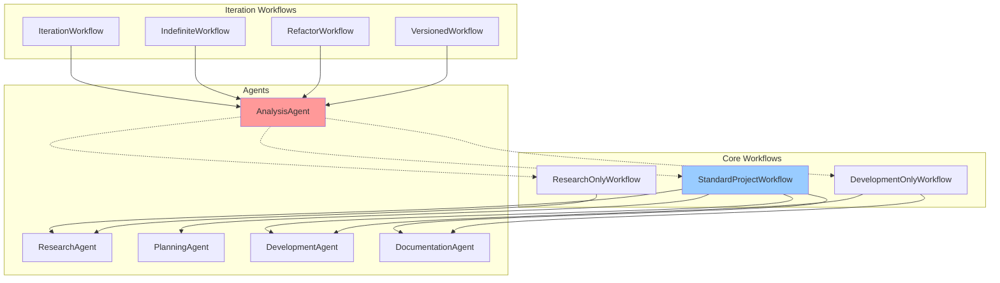

---

## Detailed Workflow Analysis

### 1. StandardProjectWorkflow
**Primary workflow for complete project development**

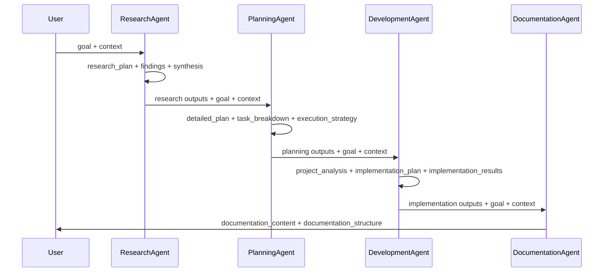

**Information Flow:**
- **Research → Planning**: Research findings inform project planning
- **Planning → Development**: Task breakdown guides implementation
- **Development → Documentation**: Implementation results drive documentation

**Current Characteristics:**
- Research findings flow directly to planning phase
- PlanningAgent handles both high-level planning AND technical architecture
- Sequential execution without validation gates between phases
- All agents have MCP tool access for enhanced capabilities

### 2. ResearchOnlyWorkflow
**Focused research for decision-making**

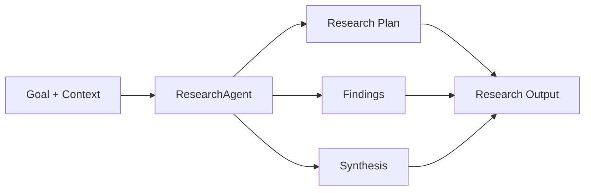

**Use Cases:**
- Pre-project research phases
- Technology evaluation
- Market analysis

### 3. DevelopmentOnlyWorkflow  
**Implementation-focused workflow**

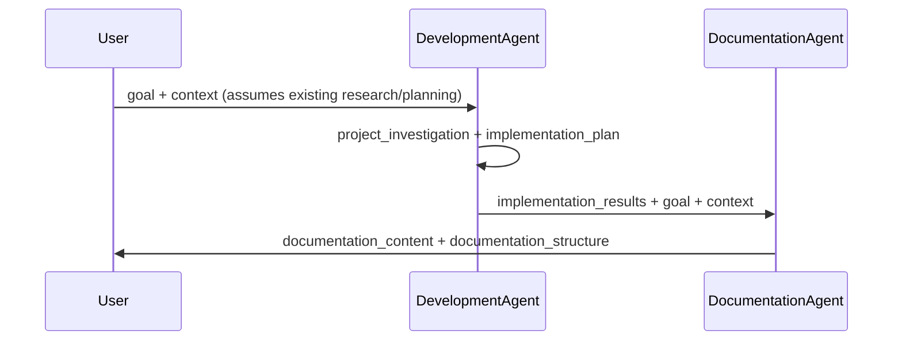

**Critical Gap:** No validation that existing context is sufficient for development

### 4. IterationWorkflow & IndefiniteWorkflow
**AnalysisAgent-driven improvement cycles**

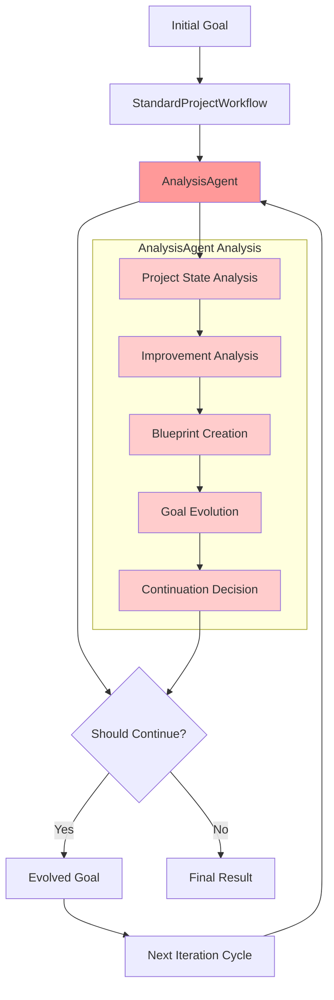

**AnalysisAgent's Central Role:**
- **Blueprint Creation**: Creates comprehensive architectural analysis
- **State Assessment**: Evaluates current project state
- **Goal Evolution**: Develops evolved goals for next iterations
- **Decision Making**: Determines when to continue or stop

### 5. RefactorWorkflow
**Analysis-driven refactoring process**

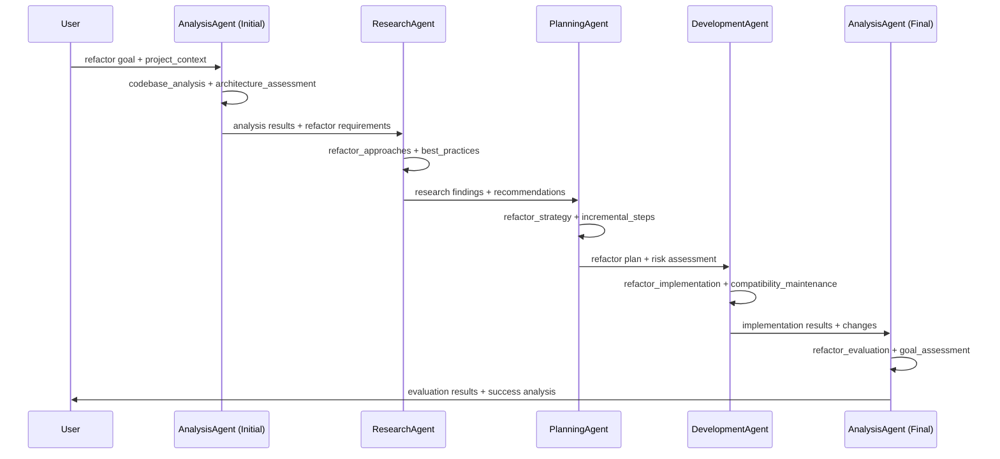

**Unique Pattern:** AnalysisAgent operates at both beginning and end, with comprehensive codebase analysis first

### 6. VersionedWorkflow
**Version-driven incremental development**

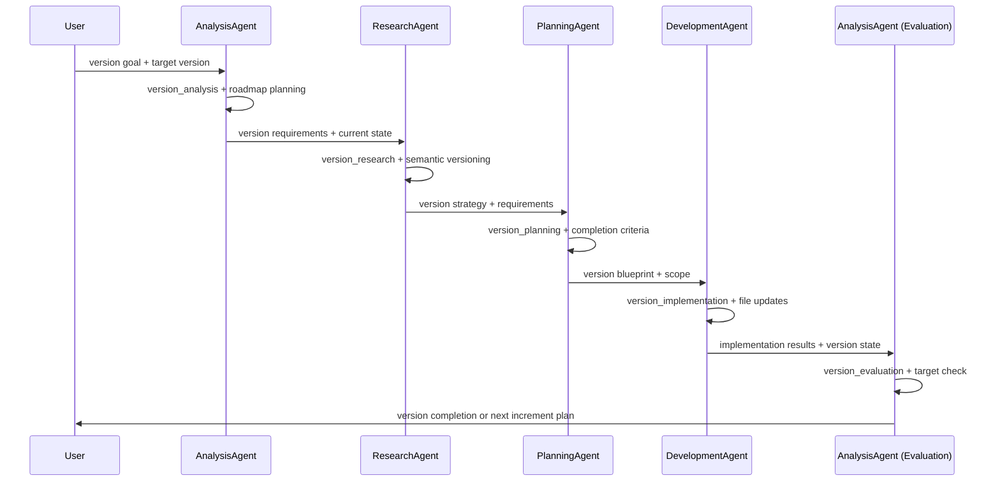

---

## Agent Capabilities & Information Flow

### Agent Responsibility Matrix

| Agent | Primary Role | Inputs | Outputs | MCP Tools - Architecture Pattern |
|-------|-------------|---------|---------|-----------------------------------|
| **ResearchAgent** | Information gathering & analysis | goal, context | research_plan, findings, synthesis | **❌ Hardcoded patterns**: Explicit calls to context7, sequential-thinking, fetch<br/>**Available**: All MCP tools via BaseAgent |
| **PlanningAgent** | Project planning & task breakdown | goal, context, research_outputs | detailed_plan, task_breakdown, execution_strategy, project_context | **❌ Hardcoded patterns**: Explicit calls to sequential-thinking<br/>**Available**: All MCP tools via BaseAgent |
| **DevelopmentAgent** | Code implementation | goal, context, planning_outputs | project_analysis, implementation_plan, implementation_results | **⚠️ Underutilized**: LLM-only, could benefit from tool integration<br/>**Available**: All MCP tools via BaseAgent |
| **AnalysisAgent** | State analysis & blueprints | goal, context, project_dir, iteration_count | project_state, improvement_analysis, should_continue, evolved_goal | **⚠️ Underutilized**: LLM-only, could benefit from tool integration<br/>**Available**: All MCP tools via BaseAgent |
| **DocumentationAgent** | Documentation creation | goal, context, implementation_outputs | project_analysis, documentation_content, documentation_structure | **⚠️ Underutilized**: LLM-only, could benefit from tool integration<br/>**Available**: All MCP tools via BaseAgent |

### **Architectural Improvement Opportunity**
**Current Issue**: Inconsistent MCP integration patterns across agents
- **ResearchAgent/PlanningAgent**: Hardcoded tool usage (inflexible)
- **Other Agents**: No tool integration (missed opportunities)

**Better Approach** (as demonstrated in CollaborativeAgent):
- **LLM-directed tool selection**: Let LLM decide which tools would enhance the response
- **Contextual tool usage**: Tools chosen based on actual task requirements
- **Flexible combinations**: LLM can intelligently combine tools
- **No hardcoded patterns**: Adaptive to changing requirements

### Information Dependencies

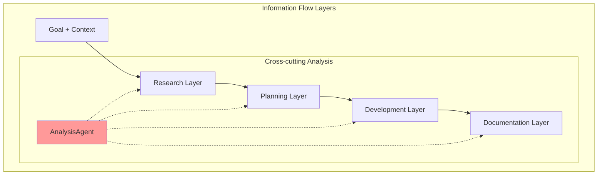

**Key Insights:**
- **Linear Information Flow**: Each agent builds on previous outputs using standardized BaseAgent interface
- **AnalysisAgent Cross-cutting**: Can analyze any layer for iterations with full MCP access
- **Sequential Execution**: Direct phase transitions without intermediate validation
- **Context Accumulation Limited**: Simple parameter passing rather than rich context scaffolding
- **Universal Tool Access**: All agents can leverage MCP tools when beneficial

---

## Current Context Handoff Mechanisms

### Standard Context Structure
```json
{
  "goal": "Primary objective",
  "context": {
    "project_dir": "Optional project directory",
    "additional_context": "Workflow-specific data"
  },
  "iteration_count": "For iterative workflows",
  "max_iterations": "Iteration limits",
  "workflow_type": "Workflow identifier"
}
```

### Agent Output Patterns
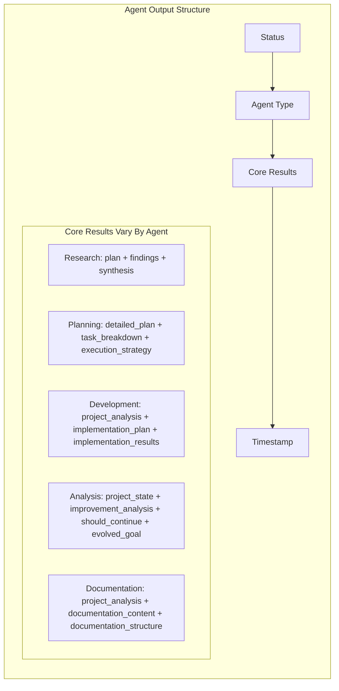

**Context Handoff Characteristics:**
1. **Standardized Base Structure**: All agents inherit BaseAgent output format (status, agent_type, core results, timestamp)
2. **Agent-Specific Content**: Core results vary by agent type while maintaining consistent structure
3. **Basic Context Passing**: Simple parameter passing rather than rich context accumulation  
4. **Limited Cross-references**: Minimal linking between agent outputs across workflow phases

---

## AnalysisAgent: The Blueprint Orchestrator

### Blueprint Creation Process

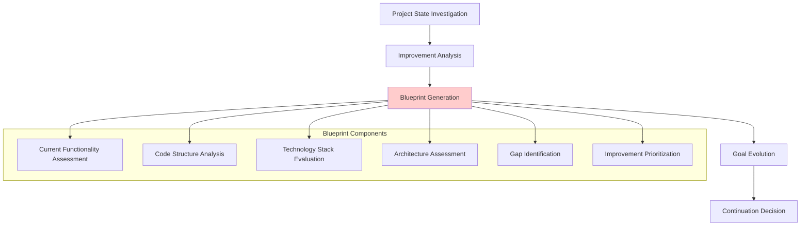

### AnalysisAgent Decision Logic

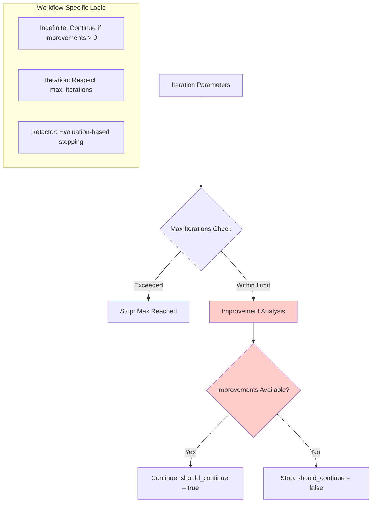

**AnalysisAgent's "Vast Blueprints" Include:**
- **Architectural Analysis**: System structure and component relationships
- **Code Quality Assessment**: Maintainability and technical debt analysis  
- **Feature Gap Analysis**: Missing functionality identification
- **Improvement Roadmap**: Prioritized enhancement recommendations
- **Integration Planning**: How changes fit with existing system

---

## Strategic Integration Opportunities

### ArchitectureAgent Integration Strategy

**Option 1: Complementary Specialization**
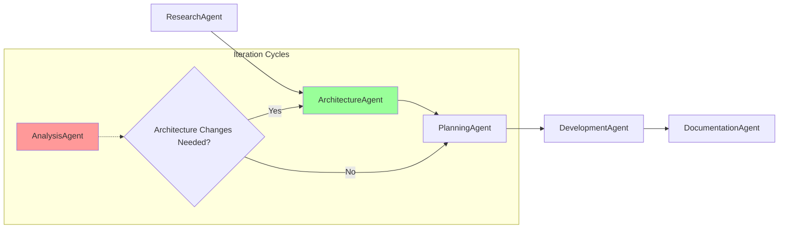

**Responsibility Separation:**
- **ArchitectureAgent**: Technical system design (APIs, data models, component architecture)
- **AnalysisAgent**: Project state analysis, improvement identification, iteration management
- **PlanningAgent**: High-level project planning, task organization

**Option 2: Collaborative Blueprint Creation**
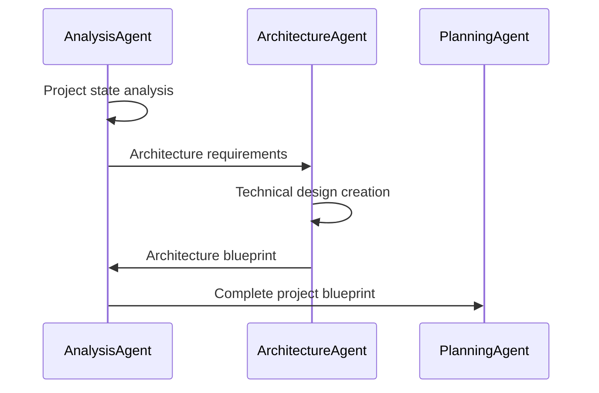

### Integration Points Without Disruption

**1. StandardProjectWorkflow Enhancement**
- Insert ArchitectureAgent between ResearchAgent and PlanningAgent
- AnalysisAgent remains unchanged for iterations

**2. RefactorWorkflow Enhancement**  
- Initial AnalysisAgent identifies architectural needs
- ArchitectureAgent handles technical design changes
- Final AnalysisAgent evaluates architectural improvements

**3. New Architecture-First Workflows**
- Create specialized workflows that lead with ArchitectureAgent
- Maintain existing workflows for non-architectural projects

---

## Recommendations for Future Architecture

### Immediate Opportunities (No Disruption)
1. **Standardize LLM-Directed Tool Usage**: Adopt CollaborativeAgent's pattern across all agents
   - Remove hardcoded tool calls from ResearchAgent/PlanningAgent
   - Add intelligent tool selection to DevelopmentAgent/AnalysisAgent/DocumentationAgent
   - Let LLM contextually decide which tools enhance each task
2. **Enhance Context Enrichment**: Build rich context accumulation on top of existing BaseAgent standardization
3. **Add Validation Gates**: Quality checks between workflow phases

### Strategic Enhancements (Minimal Disruption)
1. **Insert ArchitectureAgent**: Between research and planning in StandardProjectWorkflow
2. **Collaborative Blueprints**: AnalysisAgent + ArchitectureAgent for comprehensive analysis
3. **Architecture-Aware Iterations**: AnalysisAgent can invoke ArchitectureAgent when needed

### Long-term Vision (Transformational)
1. **Context Scaffolding System**: Rich context artifacts for optimal agent performance
2. **Quality-Driven Workflows**: Automated validation and quality scoring
3. **Adaptive Orchestration**: Dynamic workflow adaptation based on project needs

---

## Conclusion

The current SwarmDev architecture demonstrates sophisticated workflow orchestration with **AnalysisAgent serving as the central iteration orchestrator and blueprint creator**. The system is well-positioned for enhancement without disruption:

**Key Strengths:**
- Comprehensive workflow coverage for different project types (7 distinct patterns)
- Strong iteration management with AnalysisAgent orchestration
- Standardized agent interfaces through BaseAgent architecture
- Universal MCP tool integration across all agent types
- Flexible agent specialization with consistent output structures

**Strategic Opportunities:**
- **ArchitectureAgent can complement, not replace**, AnalysisAgent's blueprint creation
- **Clear integration points** exist in StandardProjectWorkflow
- **Context standardization** will amplify all agent effectiveness
- **Collaborative blueprint creation** between AnalysisAgent and ArchitectureAgent offers optimal value

**Recommended Next Steps:**
1. Enhance context enrichment on top of existing BaseAgent standardization
2. Add ArchitectureAgent to StandardProjectWorkflow between research and planning phases  
3. Optimize MCP tool usage patterns across all agent types
4. Enhance AnalysisAgent to collaborate with ArchitectureAgent for architectural blueprints
5. Maintain all existing workflows and iteration patterns unchanged

This approach preserves the proven AnalysisAgent-centered architecture and standardized BaseAgent interfaces while adding specialized technical design capabilities where they provide maximum value. 