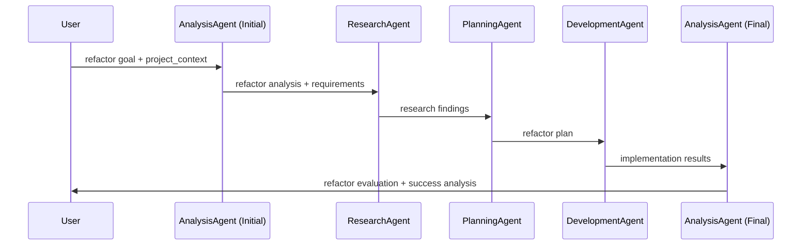
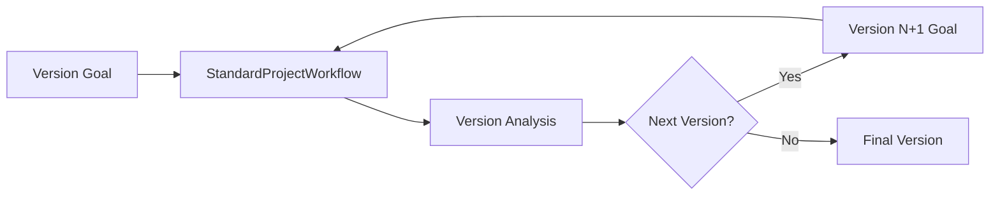

# SwarmDev Workflows Architecture Documentation

## Executive Summary

SwarmDev orchestrates 7 distinct workflow patterns using 5 specialized agents. The **AnalysisAgent plays a central role** in iteration cycles, creating "vast blueprints" and managing workflow evolution. This document provides comprehensive visual analysis of current workflows to inform architectural decisions, particularly regarding ArchitectureAgent integration.

### Current Agent Ecosystem
- **ResearchAgent**: Information gathering and analysis
- **PlanningAgent**: Project planning and task breakdown  
- **DevelopmentAgent**: Code implementation and file generation
- **AnalysisAgent**: Project state analysis, blueprints, iteration management
- **DocumentationAgent**: Documentation creation and maintenance

### Key Architectural Insights
1. **AnalysisAgent is the iteration orchestrator** - manages cycles, creates evolved goals
2. **No dedicated architecture phase** - technical design mixed with planning
3. **Limited context standardization** - inconsistent information handoff
4. **Blueprint creation centralized** - AnalysisAgent handles architectural analysis

---

## Workflow Overview Architecture


---

## Detailed Workflow Analysis

### 1. StandardProjectWorkflow
**Primary workflow for complete project development**


**Information Flow:**
- **Research → Planning**: Research findings inform project planning
- **Planning → Development**: Task breakdown guides implementation
- **Development → Documentation**: Implementation results drive documentation

**Current Gaps:**
- No architectural design phase between research and planning
- PlanningAgent handles both high-level planning AND technical architecture
- No validation gates between phases

### 2. ResearchOnlyWorkflow
**Focused research for decision-making**


**Use Cases:**
- Pre-project research phases
- Technology evaluation
- Market analysis

### 3. DevelopmentOnlyWorkflow  
**Implementation-focused workflow**


**Critical Gap:** No validation that existing context is sufficient for development

### 4. IterationWorkflow & IndefiniteWorkflow
**AnalysisAgent-driven improvement cycles**


**AnalysisAgent's Central Role:**
- **Blueprint Creation**: Creates comprehensive architectural analysis
- **State Assessment**: Evaluates current project state
- **Goal Evolution**: Develops evolved goals for next iterations
- **Decision Making**: Determines when to continue or stop

### 5. RefactorWorkflow
**Analysis-driven refactoring process**



**Unique Pattern:** AnalysisAgent operates at both beginning and end

### 6. VersionedWorkflow
**Version-driven incremental development**



---

## Agent Capabilities & Information Flow

### Agent Responsibility Matrix

| Agent | Primary Role | Inputs | Outputs | MCP Tools Used |
|-------|-------------|---------|---------|---------------|
| **ResearchAgent** | Information gathering & analysis | goal, context | research_plan, findings, synthesis | sequential-thinking, context7, fetch |
| **PlanningAgent** | Project planning & task breakdown | goal, context, research_outputs | detailed_plan, task_breakdown, execution_strategy, project_context | sequential-thinking |
| **DevelopmentAgent** | Code implementation | goal, context, planning_outputs | project_analysis, implementation_plan, implementation_results | None (LLM-driven) |
| **AnalysisAgent** | State analysis & blueprints | goal, context, project_dir, iteration_count | project_state, improvement_analysis, should_continue, evolved_goal | None (LLM-driven) |
| **DocumentationAgent** | Documentation creation | goal, context, implementation_outputs | project_analysis, documentation_content, documentation_structure | None (LLM-driven) |

### Information Dependencies


**Key Insights:**
- **Linear Information Flow**: Each agent builds on previous outputs
- **AnalysisAgent Cross-cutting**: Can analyze any layer for iterations
- **No Validation Gates**: Missing quality checks between phases
- **Context Accumulation Limited**: Basic context passing, no rich scaffolding

---

## Current Context Handoff Mechanisms

### Standard Context Structure
```json
{
  "goal": "Primary objective",
  "context": {
    "project_dir": "Optional project directory",
    "additional_context": "Workflow-specific data"
  },
  "iteration_count": "For iterative workflows",
  "max_iterations": "Iteration limits",
  "workflow_type": "Workflow identifier"
}
```

### Agent Output Patterns


**Context Handoff Gaps:**
1. **No Standardized Format**: Each agent uses different output structures
2. **Limited Context Enrichment**: Basic parameter passing vs. rich context building
3. **No Quality Validation**: No checks for context completeness
4. **Missing Cross-references**: Limited linking between agent outputs

---

## AnalysisAgent: The Blueprint Orchestrator

### Blueprint Creation Process


### AnalysisAgent Decision Logic


**AnalysisAgent's "Vast Blueprints" Include:**
- **Architectural Analysis**: System structure and component relationships
- **Code Quality Assessment**: Maintainability and technical debt analysis  
- **Feature Gap Analysis**: Missing functionality identification
- **Improvement Roadmap**: Prioritized enhancement recommendations
- **Integration Planning**: How changes fit with existing system

---

## Strategic Integration Opportunities

### ArchitectureAgent Integration Strategy

**Option 1: Complementary Specialization**


**Responsibility Separation:**
- **ArchitectureAgent**: Technical system design (APIs, data models, component architecture)
- **AnalysisAgent**: Project state analysis, improvement identification, iteration management
- **PlanningAgent**: High-level project planning, task organization

**Option 2: Collaborative Blueprint Creation**


### Integration Points Without Disruption

**1. StandardProjectWorkflow Enhancement**
- Insert ArchitectureAgent between ResearchAgent and PlanningAgent
- AnalysisAgent remains unchanged for iterations

**2. RefactorWorkflow Enhancement**  
- Initial AnalysisAgent identifies architectural needs
- ArchitectureAgent handles technical design changes
- Final AnalysisAgent evaluates architectural improvements

**3. New Architecture-First Workflows**
- Create specialized workflows that lead with ArchitectureAgent
- Maintain existing workflows for non-architectural projects

---

## Recommendations for Future Architecture

### Immediate Opportunities (No Disruption)
1. **Standardize Context Handoff**: Create unified agent output format
2. **Add Validation Gates**: Quality checks between workflow phases
3. **Enhance Context Accumulation**: Rich context building vs. basic parameter passing

### Strategic Enhancements (Minimal Disruption)
1. **Insert ArchitectureAgent**: Between research and planning in StandardProjectWorkflow
2. **Collaborative Blueprints**: AnalysisAgent + ArchitectureAgent for comprehensive analysis
3. **Architecture-Aware Iterations**: AnalysisAgent can invoke ArchitectureAgent when needed

### Long-term Vision (Transformational)
1. **Context Scaffolding System**: Rich context artifacts for optimal agent performance
2. **Quality-Driven Workflows**: Automated validation and quality scoring
3. **Adaptive Orchestration**: Dynamic workflow adaptation based on project needs

---

## Conclusion

The current SwarmDev architecture demonstrates sophisticated workflow orchestration with **AnalysisAgent serving as the central iteration orchestrator and blueprint creator**. The system is well-positioned for enhancement without disruption:

**Key Strengths:**
- Comprehensive workflow coverage for different project types
- Strong iteration management with AnalysisAgent
- Flexible agent specialization
- Proven MCP tool integration

**Strategic Opportunities:**
- **ArchitectureAgent can complement, not replace**, AnalysisAgent's blueprint creation
- **Clear integration points** exist in StandardProjectWorkflow
- **Context standardization** will amplify all agent effectiveness
- **Collaborative blueprint creation** between AnalysisAgent and ArchitectureAgent offers optimal value

**Recommended Next Steps:**
1. Implement standardized context handoff format
2. Add ArchitectureAgent to StandardProjectWorkflow between research and planning phases
3. Enhance AnalysisAgent to collaborate with ArchitectureAgent for architectural blueprints
4. Maintain all existing workflows and iteration patterns unchanged

This approach preserves the proven AnalysisAgent-centered architecture while adding specialized technical design capabilities where they provide maximum value. 